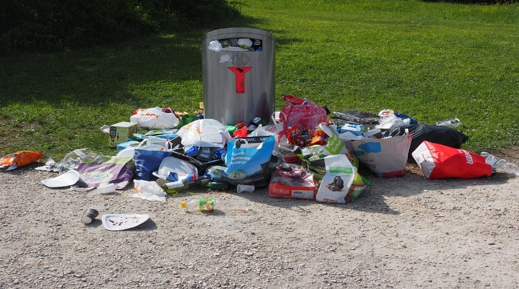

# Klasifikasi Gambar Sampah Rumah Tangga Menggunakan CNN



Proyek ini merupakan implementasi deep learning untuk mengklasifikasikan gambar sampah rumah tangga ke dalam tiga kategori utama. Model dibangun menggunakan arsitektur Convolutional Neural Network (CNN) dengan framework TensorFlow dan Keras. Tujuan utama dari proyek ini adalah untuk membantu proses pemilahan sampah secara otomatis melalui teknologi pengenalan gambar.

Model telah diekspor dalam berbagai format agar dapat digunakan lintas platform, mulai dari deployment di server hingga integrasi pada aplikasi web dan perangkat mobile.

---

## Ringkasan Proyek

- Model dikembangkan menggunakan TensorFlow dan Keras (Sequential API).
- Dataset berasal dari Kaggle: [Garbage Classification Dataset](https://www.kaggle.com/mostafaabla/garbage-classification).
- Dataset asli memiliki 12 kelas dan telah direstrukturisasi menjadi 3 kelas utama agar lebih seimbang.
- Proses augmentasi diterapkan untuk meningkatkan variasi data.
- Model berhasil mencapai akurasi >85% pada data validasi dan pengujian.
- Model diekspor ke format SavedModel, TF-Lite, dan TFJS.
- Disediakan pula antarmuka inferensi berbasis upload gambar secara langsung di notebook.

---

## Struktur Label (Kelas)

| Label Baru           | Label Asli yang Digabung                                                 |
|----------------------|---------------------------------------------------------------------------|
| `domestic_textile`   | `clothes`, `shoes`, `biological`                                          |
| `recyclables`        | `plastic`, `metal`, `cardboard`, `paper`, `brown-glass`, `white-glass`, `green-glass` |
| `residual_special`   | `trash`, `battery`                                                        |

---

## Struktur Dataset

Dataset telah dipisahkan ke dalam 3 subset:
- `train/` untuk data pelatihan
- `val/` untuk data validasi
- `test/` untuk evaluasi akhir model

Setiap subset memiliki direktori label: `domestic_textile`, `recyclables`, dan `residual_special`.

---

## Evaluasi Model

- Model dievaluasi menggunakan akurasi dan loss untuk setiap subset.
- Inference juga dilakukan pada data uji serta gambar yang diunggah pengguna.
- Akurasi pengujian akhir tercatat di atas ambang minimum 85%.

---

## Format Model

Model telah diekspor dalam 3 format berikut:

1. **SavedModel**  
   - Path: `saved_model/`
   - Digunakan untuk deployment server atau konversi lebih lanjut.

2. **TFLite (TensorFlow Lite)**  
   - Path: `tflite/model.tflite`
   - Dilengkapi dengan `label.txt` untuk memetakan hasil prediksi.

3. **TensorFlow.js**  
   - Path: `tfjs_model/`
   - Dapat digunakan untuk aplikasi berbasis web dan JavaScript.

---

## Inference Gambar (TF-Lite)

Notebook ini menyediakan fungsi upload gambar dan melakukan klasifikasi gambar secara langsung menggunakan model TFLite dan file `label.txt`.

Contoh output:
```bash
Prediksi kelas: recyclables
